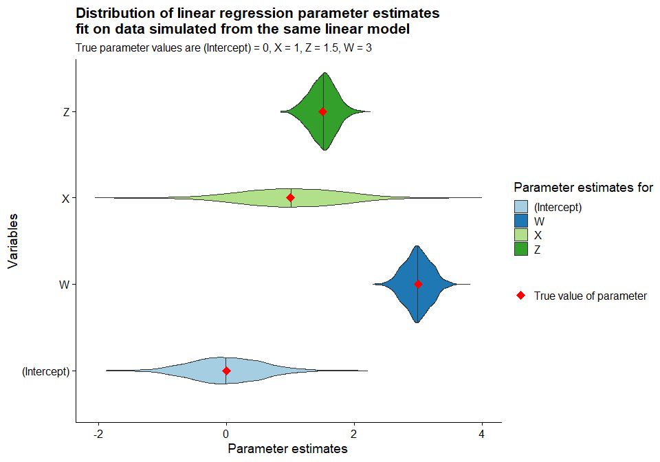
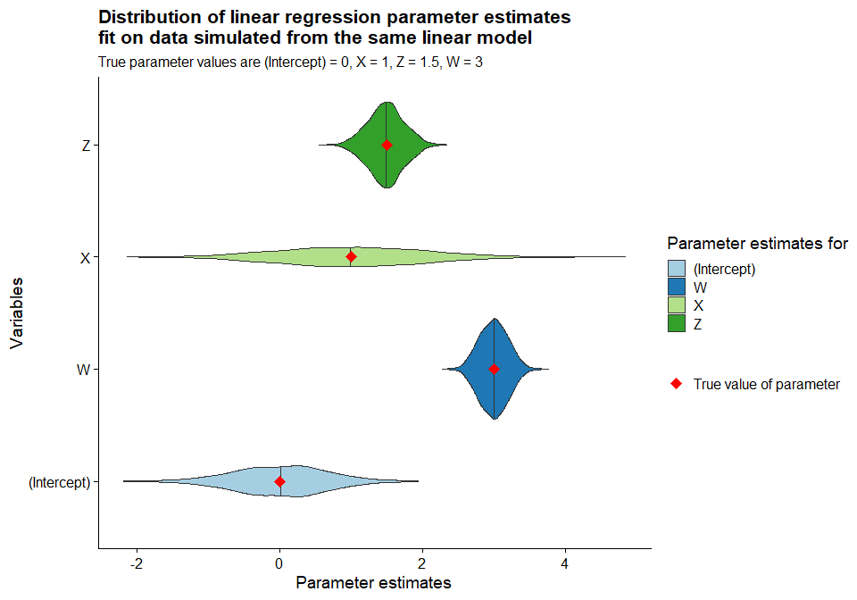
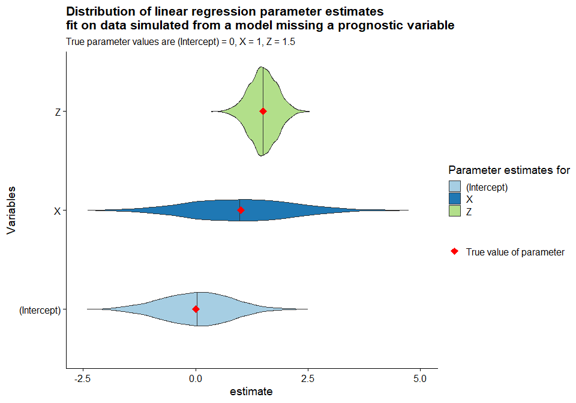
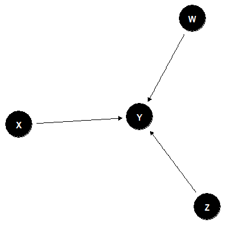
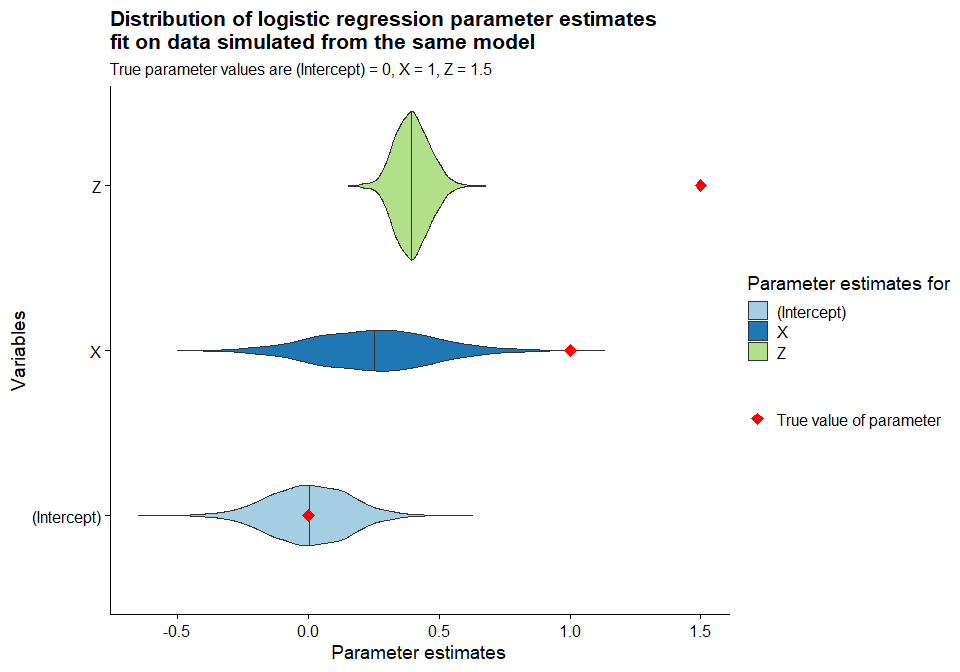

Simulating collapsibility
================
John Fee
2024-02-28

- [A linear model](#a-linear-model)
  - [Scenario 1 - No confounders](#scenario-1---no-confounders)
  - [Scenario 2 - Confounders
    present](#scenario-2---confounders-present)
  - [Scenario 3 - Confounders present, prognostic variable
    omitted](#scenario-3---confounders-present-prognostic-variable-omitted)
- [A (non identity/log link) GLM - logistic
  regression](#a-non-identitylog-link-glm---logistic-regression)
  - [Scenario 1 - No confounders](#scenario-1---no-confounders-1)
  - [Scenario 2 - Confounders
    present](#scenario-2---confounders-present-1)
  - [Scenario 3 - Confounders present, prognostic variable
    omitted](#scenario-3---confounders-present-prognostic-variable-omitted-1)

``` r
# I/O
library(here)

# Data manipulation
library(dplyr)
library(purrr)
library(tidyr)

# Graphics
library(ggplot2)
library(ggdag)
library(dagitty)
library(latex2exp)
theme_set(cowplot::theme_cowplot())

# Misc
source(here("R","sim-functions.R"))
set.seed(1)
n_simulations = 2000
```

I’m going to walk through a few different scenarios with different data
generating processes, and via simulation examine how well I can recover
the true value of the parameter of interest.

# A linear model

## Scenario 1 - No confounders

For our DGP, assume that I observe the values of a continuous response
variable $Y$, a binary treatment variable $X$, and measured covariates
$W$ and $Z$. $X$, $Y$, and $Z$ are mutually independent, but $Y$ is
dependent upon all of them. This dependency structure can be represented
graphically in the form of a DAG.

``` r
dagify(
  Y ~ X,
  Y ~ W,
  Y ~ Z
) %>%
  ggdag() +
  theme_void()
```


To simulate data compatible with this structure, I draw the predictors
from a multivariate normal distribution with a diagonal covariance
matrix (i.e. they are independent draws from separate normal
distributions). $X$ is thresholded to convert it into a binary variable,
and $Y$ is generated by the following equations

$$
\begin{aligned}
  Y &= X + 3W + 1.5Z + \varepsilon\\
  \varepsilon &\sim \mathcal{N}(0,9)
\end{aligned}
$$

This process is repeated until 1000 datasets of size 2,000 are
generated. I then fit the same linear model to each simulated dataset,
and plot the distribution of the results and provide a table of summary
stats.

``` r
cov_matrix_diagonal <- matrix(
  c(
    4,0,0,
    0,4,0,
    0,0,4
  ),
  nrow = 3,
  ncol = 3,
  byrow = TRUE
)

results <- simulate_multiple_datasets(
  n = 500,
  sigma = cov_matrix_diagonal,
  n_simulations = n_simulations,
  simulate_function = simulate_linear_model,
  y_formula = 3*W + X + 1.5*Z,
  x_threshold = qnorm(0.5), # Chosen so X is a 50/50 split in both treatment groups
  epsilon_sd = 9
) %>%
  mutate(
      fitted_model = map(data,~ lm(Y ~ X + Z + W,data = .x))
    )
```

``` r
true_coefs <- data.frame(
  parameter = c("(Intercept)","X","Z","W"),
  true_value = c(0,1,1.5,3)
  )

coef_df <- true_coefs %>%
  get_coef_df(results,.)

plot_coefficient_distribution(
  coef_df,
  title = "Distribution of linear regression parameter estimates \nfit on data simulated from the same linear model"
  )
```



``` r
coef_df %>%
  summarize_coef_df(caption = "Summary table for parameters of $n = 1000$ linear models fit on simulated data")
```

| Variable    | Parameter estimate | True value |       Bias |
|:------------|-------------------:|-----------:|-----------:|
| (Intercept) |         -0.0006715 |        0.0 | -0.0006715 |
| W           |          2.9863047 |        3.0 | -0.0136953 |
| X           |          1.0019431 |        1.0 |  0.0019431 |
| Z           |          1.5033687 |        1.5 |  0.0033687 |

Summary table for parameters of $n = 1000$ linear models fit on
simulated data

As expected, the linear model provides unbiased estimates of the effect
associated with our treatment variable $X$. Varying the dataset size or
the amount of noise (variance of $\varepsilon$) would change the shape
of the simulated parameter distributions, but they would remain
unbiased. What if we have a more complicated dependency structure?

## Scenario 2 - Confounders present

Let’s take the same setup as scenario 1, but instead $X$ and $Y$ both
depend on $Z$.

``` r
dagify(
  Y ~ X,
  Y ~ W,
  Y ~ Z,
  X ~ Z
) %>%
  ggdag() +
  theme_void()
```


It is sufficient to condition on $X$ and $Z$ to recover the correct
coefficient for $X$. Let’s simulate the data and model fitting and check
that this this true.

``` r
cov_matrix_confounding <- matrix(
  c(
    4,0,0,
    0,4,3,
    0,3,4
  ),
  nrow = 3,
  ncol = 3,
  byrow = TRUE
)

results <- simulate_multiple_datasets(
  n = 500,
  sigma = cov_matrix_confounding,
  n_simulations = n_simulations,
  simulate_function = simulate_linear_model,
  y_formula = 3*W + X + 1.5*Z,
  x_threshold = qnorm(0.5), # Chosen so X is a 50/50 split in both treatment groups
  epsilon_sd = 9
) %>%
  mutate(
      fitted_model = map(data,~ lm(Y ~ X + Z + W,data = .x))
    )
```

``` r
coef_df <- true_coefs %>%
  get_coef_df(results,.)

plot_coefficient_distribution(
  coef_df,
  title = "Distribution of linear regression parameter estimates \nfit on data simulated from the same linear model"
  )
```



``` r
coef_df %>%
  summarize_coef_df(caption = "Summary table for parameters of $n = 1000$ linear models fit on simulated data with confounder")
```

| Variable    | Parameter estimate | True value |       Bias |
|:------------|-------------------:|-----------:|-----------:|
| (Intercept) |          0.0118017 |        0.0 |  0.0118017 |
| W           |          2.9995821 |        3.0 | -0.0004179 |
| X           |          1.0079182 |        1.0 |  0.0079182 |
| Z           |          1.4907873 |        1.5 | -0.0092127 |

Summary table for parameters of $n = 1000$ linear models fit on
simulated data with confounder

The above simulation matches with our supposition that conditioning on
$Z$ will provide unbiased estimates of the coefficient for $X$. Note
that the variance of the estimate for $X$ is larger than in scenario 1,
when $X$ and $Z$ were uncorrelated (this is expected). Now what happens
if we remove $W$, a prognostic variable, from the models I fit, but *do
not* remove $W$ from the DGP?

## Scenario 3 - Confounders present, prognostic variable omitted

I now repeat scenario 3, but remove $W$ from the models I fit to the
data.

``` r
results <- simulate_multiple_datasets(
  n = 500,
  sigma = cov_matrix_confounding,
  n_simulations = n_simulations,
  simulate_function = simulate_linear_model,
  y_formula = 3*W + X + 1.5*Z,
  x_threshold = qnorm(0.5), # Chosen so X is a 50/50 split in both treatment groups
  epsilon_sd = 9
) %>%
  mutate(
      fitted_model = map(data,~ lm(Y ~ X + Z,data = .x))
    )
```

``` r
coef_df <- true_coefs %>%
  get_coef_df(results,.)

plot_coefficient_distribution(
  coef_df,
  title = "Distribution of linear regression parameter estimates \nfit on data simulated from a model missing a prognostic variable"
  ) +
  lims(x = c(-2.5,5))
```



``` r
coef_df %>%
  summarize_coef_df(caption = "Summary table for parameters of $n = 1000$ linear models fit on simulated data with confounder present and prognostic variable omitted")
```

| Variable    | Parameter estimate | True value |       Bias |
|:------------|-------------------:|-----------:|-----------:|
| (Intercept) |          0.0171784 |        0.0 |  0.0171784 |
| X           |          0.9880821 |        1.0 | -0.0119179 |
| Z           |          1.5011808 |        1.5 |  0.0011808 |

Summary table for parameters of $n = 1000$ linear models fit on
simulated data with confounder present and prognostic variable omitted

Coefficient for $X$ remains unbiased, even though prognostic variable
$W$ is removed. This is a property exclusive to regression with identity
and log link functions, as we shall see in the following sections.

# A (non identity/log link) GLM - logistic regression

## Scenario 1 - No confounders

For this section, I’m going to modify our DGP to be compatible with a
different type of model. Assume that I observe the values of a
**discrete** response variable $Y$, a binary treatment variable $X$, and
measured covariates $W$ and $Z$. $X$, $Y$, and $Z$ are mutually
independent, but $Y$ is dependent upon all of them.

The DAG is the same as in scenario 1 for linear regression (since it’s
just a graph of dependencies between variables).

``` r
dagify(
  Y ~ X,
  Y ~ W,
  Y ~ Z
) %>%
  ggdag() +
  theme_void()
```



To simulate data compatible with this structure and the logistic
regression model, I draw the predictors from a multivariate normal
distribution with a diagonal covariance matrix (i.e. they are
independent draws from separate normal distributions). $X$ is
thresholded to convert it into a binary variable, and $Y$ is generated
by the equations below.

$$
\begin{aligned}
  A &= X + 3W + 1.5Z\\
  Y_{prob} &= \frac{1}{1 + \exp{A}}\\
  Y &\sim \text{Bernoulli}(Y_{prob})
\end{aligned}
$$

``` r
results <- simulate_multiple_datasets(
  n = 500,
  sigma = cov_matrix_diagonal,
  n_simulations = n_simulations,
  simulate_function = simulate_logistic_reg_model,
  y_formula = 3*W + X + 1.5*Z,
  x_threshold = qnorm(0.5) # Chosen so X is a 50/50 split in both treatment groups
) %>%
  mutate(
    fitted_model = map(data,~ glm(
      outcome ~ X + Z + W,
      family = binomial(link = "logit"),
      data = .x))
    )
```

``` r
coef_df <- true_coefs %>%
  get_coef_df(results,.)

plot_coefficient_distribution(
  coef_df,
  title = "Distribution of logistic regression parameter estimates \nfit on data simulated from the same model"
  )
```


``` r
coef_df %>%
  summarize_coef_df(caption = "Summary table for parameters of $n = 1000$ logistic GLMs fit on simulated data")
```

| Variable    | Parameter estimate | True value |      Bias |
|:------------|-------------------:|-----------:|----------:|
| (Intercept) |          0.0018037 |        0.0 | 0.0018037 |
| W           |          3.1080864 |        3.0 | 0.1080864 |
| X           |          1.0384740 |        1.0 | 0.0384740 |
| Z           |          1.5562909 |        1.5 | 0.0562909 |

Summary table for parameters of $n = 1000$ logistic GLMs fit on
simulated data

Parameter estimates for logistic regression are biased (upwards) in
finite samples, so we expect some positive bias. This isn’t too bad (we
could do better with e.g. Firth penalized logistic regression), but
we’re mainly interested in differences between the scenarios.

## Scenario 2 - Confounders present

Let’s take the same setup as scenario 1, but instead $X$ and $Y$ both
depend on $Z$.

``` r
dagify(
  Y ~ X,
  Y ~ W,
  Y ~ Z,
  X ~ Z
) %>%
  ggdag() +
  theme_void()
```


``` r
results <- simulate_multiple_datasets(
  n = 500,
  sigma = cov_matrix_confounding,
  n_simulations = n_simulations,
  simulate_function = simulate_logistic_reg_model,
  y_formula = 3*W + X + 1.5*Z,
  x_threshold = qnorm(0.5) # Chosen so X is a 50/50 split in both treatment groups
) %>%
  mutate(
    fitted_model = map(data,~ glm(
      outcome ~ X + Z + W,
      family = binomial(link = "logit"),
      data = .x))
    )
```

``` r
coef_df <- true_coefs %>%
  get_coef_df(results,.)

plot_coefficient_distribution(
  coef_df,
  title = "Distribution of logistic regression parameter estimates \nfit on data simulated from the same model"
  )
```


``` r
coef_df %>%
  summarize_coef_df(caption = "Summary table for parameters of $n = 1000$ logistic GLMs fit on simulated data with confounders")
```

| Variable    | Parameter estimate | True value |      Bias |
|:------------|-------------------:|-----------:|----------:|
| (Intercept) |          0.0026718 |        0.0 | 0.0026718 |
| W           |          3.1079115 |        3.0 | 0.1079115 |
| X           |          1.0269148 |        1.0 | 0.0269148 |
| Z           |          1.5506238 |        1.5 | 0.0506238 |

Summary table for parameters of $n = 1000$ logistic GLMs fit on
simulated data with confounders

Basically the same results - no surprises there (we adjusted for the
confounder).

## Scenario 3 - Confounders present, prognostic variable omitted

Now I remove $W$ from the model fitting.

``` r
results <- simulate_multiple_datasets(
  n = 500,
  sigma = cov_matrix_confounding,
  n_simulations = n_simulations,
  simulate_function = simulate_logistic_reg_model,
  y_formula = 3*W + X + 1.5*Z,
  x_threshold = qnorm(0.5) # Chosen so X is a 50/50 split in both treatment groups
) %>%
  mutate(
    fitted_model = map(data,~ glm(
      outcome ~ X + Z,
      family = binomial(link = "logit"),
      data = .x))
    )
```

``` r
coef_df <- true_coefs %>%
  get_coef_df(results,.)

plot_coefficient_distribution(
  coef_df,
  title = "Distribution of logistic regression parameter estimates \nfit on data simulated from the same model"
  )
```



``` r
coef_df %>%
  summarize_coef_df(caption = "Summary table for parameters of $n = 1000$ logistic GLMs fit on simulated data with confounders and prognostic variable omitted.")
```

| Variable    | Parameter estimate | True value |       Bias |
|:------------|-------------------:|-----------:|-----------:|
| (Intercept) |          0.0038391 |        0.0 |  0.0038391 |
| X           |          0.2542688 |        1.0 | -0.7457312 |
| Z           |          0.3978926 |        1.5 | -1.1021074 |

Summary table for parameters of $n = 1000$ logistic GLMs fit on
simulated data with confounders and prognostic variable omitted.

The estimated coefficients are now way off, even though we conditioned
on the only confounder! The non-collapsibility of logistic regression
implies that we need to condition on all variables that contribute to
variation in $Y$.
